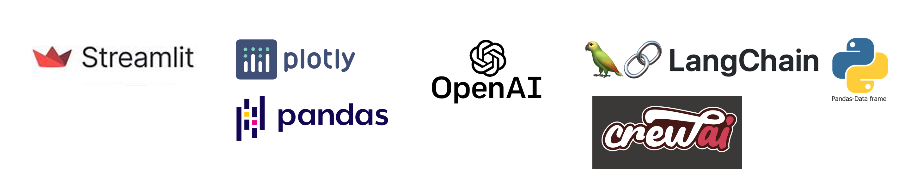

## About This App
This app leverages a range of **Generative AI** tools and libraries to analyze **HDB resale flat** data and website information, creating **chatbots** 1️⃣💰 2️⃣📝 that interact with users through a user-friendly Streamlit front end. These two specialized chatbots are designed to assist users throughout their **HDB Resale Flat Buying Journey**.

Click on [HDB Resale Chatbots](https://hdb-resale-chatbots.streamlit.app/) for the Streamlit App

### Project Scope
Embarking on the journey to **purchase a HDB resale flat** can feel overwhelming, but this application is here to simplify the process for you!

1️⃣💰 **Resale Price Chatbot**: Curious about past resale prices? This chatbot lets you ask questions in natural language, helping you explore the historical prices of your preferred town areas and flat types with ease.

2️⃣📝 **Resale Process Chatbot**: Have questions about eligibility, grants, documentation, timelines, or anything else related to buying a HDB resale flat? This chatbot is your go-to resource, providing clear answers and guidance every step of the way.

With this app, you'll navigate the complexities of purchasing a resale flat confidently and informed!

### Objectives
**Use cases** to streamline your search on **HDB Resale Flat Prices & Process**

1️⃣💰 Say goodbye to the hassle of sifting through extensive past resale listings or navigating complex charts and dashboards that may not align with your preferences. You can effortlessly filter by your preferred town areas, flat types, and sold date range, then engage in a conversation with the chatbot to obtain tailored resale price information.

2️⃣📝 Let our chatbot handle the heavy lifting by browsing official resale procedural information directly from the HDB website on your behalf. Simply enter your question, and sit back as it provides you with the answers you need!

### Data Sources
1. HDB Website: [https://www.hdb.gov.sg/residential/buying-a-flat/buying-procedure-for-resale-flats](https://www.hdb.gov.sg/residential/buying-a-flat/buying-procedure-for-resale-flats) 
2. Data.gov.sg: [https://data.gov.sg/datasets/d_8b84c4ee58e3cfc0ece0d773c8ca6abc/view](https://data.gov.sg/datasets/d_8b84c4ee58e3cfc0ece0d773c8ca6abc/view) Resale flat prices based on registration date from Jan-2017 onwards. The App will use use the transactions **from Jan-2021** as the more recent transactions are more relevant to the Resale Price Query.

### Features
1️⃣💰 Filters, Past Resale Transactions, Conversational Query - Allow buyers to sense what they can afford (which town areas, flat types) given the history of the resale market to make a more informed decision.

2️⃣📝 Pictorial Process Guide, Conversation Query - Provides a quick answer to your questions on the process of buying a HDB Resale Flat.

*️⃣🏠 Home Page provides context and easy navigation with links, disclaimer, side bar with all links. At the chatbot input, help text and example questions are provided.

### Tools Used
Go to the **Methodology** page to discover how these tools work together in the chatbots.
